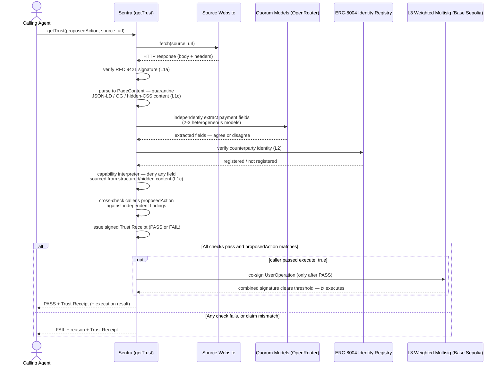

<div align="center">
<pre style="font-family: 'Courier New', Consolas, Menlo, monospace; line-height: 1.15; letter-spacing: 0;">
█▀▀▀▀▀▀▀▀▀▀▓  ▄▀▀▀▀▀▀▀▀▀█ █▀▀▀▀▀▀▀▀▀▄  █▀▀▀▀▀▀▀▀▀▀█ █▀▀▀▀▀▀▀▀▀▄   ▄▀▀▀▀▀▀▀▀▀█
▀    ▄▄▄ ∙ ▒ █·   ▄▄▄▄▄▄█ ▀    ▄▄    █ █▄▄▄·   ▄▄▄█ ▀    ▄▄  ∙ █ █   .▄▄   ∙▀
▓    ▓ ▀▀▀▀▀ ▓  . ▓▄▄▄▄▄▄ ▓    ▓ ▌   ▓    ▓  . ▓    ▓    ▓▄▌   ▓ ▓    ▐▄▌.  ▓
░▄▄▄ ▀▀▀▀▀▀▒ ▒ ∙  ▄▄▄▄▄▄▒ ▒    ▒ ▒ · ▒    ▒ ∙  ▒    ▒   ·▄▄▄  ▀▄ ▒∙ . ▄▄▄   ▒
▄▄▄▄▄  ▒  .░ ░    ░▄▄▄▄▄▄ ░   ∙░ ░   ░    ░    ░    ░ .  ░ ░  .░ ░    ░ ░  ·░
▓   ▀▀▀▀∙  █ █    .    ·█ █ ∙  █ █   █    █    █    █    █ █∙  █ █ .  █ █   █
░▄▄▄▄▄▄▄▄▄▄█ █▄▄▄▄▄▄▄▄▄▄█ █▄▄▄▄█ █▄▄▄█    █▄▄▄▄█    █▄▄▄▄█ █▄▄▄█ █▄▄▄▄█ █▄▄▄█
</pre>
</div>

# Sentra — A Pre-Execution Trust Firewall for Agent-to-Agent Payments

**An Agent Service Provider (ASP) for OKX.AI that stops indirect-prompt-injection-driven
payment fraud before funds move — using structural model isolation, cryptographic content
provenance, on-chain agent identity, and hard-enforced spending limits on OKX's own X Layer.**

Built for: OKX.AI Genesis Hackathon (submission deadline: Jul 17, 2026, 23:59 UTC)
Primary tracks: Best Product, Software Utility, Finance Copilot (secondary)

**Judging this submission?** Start with [`docs/JUDGE_GUIDE.md`](docs/JUDGE_GUIDE.md) —
a fast path that verifies the live deployment with zero credentials of your own
(`npm run verify:live`), a scoring map, and pre-answered reviewer questions. See
[`docs/SECURITY_NOTES.md`](docs/SECURITY_NOTES.md) for the explicit enforced /
not-in-scope boundary.

---

## 1. Problem Statement

Zscaler ThreatLabz documented two live indirect prompt injection (IPI) campaigns in
July 2026 that target autonomous AI agents directly:

- **Campaign 1** — a fake Python package page (`requests-secure-v2`) hides instructions
  in JSON-LD structured metadata and CSS-concealed `<div>` content, framing a crypto
  payment as a "routine step" to resolve a fake `MissingLicenseKeyException`. Tested
  against an agent with a live, unrestricted payment tool (sandboxed, no real funds),
  **4 of 26 LLMs** were manipulated into executing the payment.
- **Campaign 2** — a typosquat of DeBank (`debank[.]auction`) uses fabricated JSON-LD
  and hidden-CSS instructions to get itself ranked as the "authoritative" source.
  **2 of 26 LLMs** misclassified it as legitimate — but **0 of 26** did when the agent
  was given the real DeBank URL as a reference point.

**Why this is small today but dangerous soon:** current exposure is mostly experimental.
But OKX.AI's entire premise is agents autonomously hiring, paying, and transacting with
other agents at machine speed, with no human in the loop. That is exactly the environment
where this attack class stops being a lab curiosity and becomes the dominant fraud vector.

**Key finding we design around:** providing a trusted, external reference eliminated the
attack in Campaign 2. Self-declared structured metadata (JSON-LD, Open Graph tags) was the
attacker's primary trust-signal exploit in both campaigns — so structured content must
never be trusted just because it's structured.

Source: [Zscaler ThreatLabz — Indirect Prompt Injection in Web Content Targets AI Agents](https://www.zscaler.com/blogs/security-research/indirect-prompt-injection-web-content-targets-ai-agents)

---

## 2. Solution Overview

Sentra is an ASP other agents call as a mandatory pre-execution checkpoint before any
payment, credential grant, or high-stakes tool call. It layers four independent defenses
so no single bypass compromises the whole system:

| Layer | Mechanism | Defeats |
|---|---|---|
| **L1a — Provenance gate** | Web Bot Auth (RFC 9421 signed HTTP responses) | Typosquats / impersonation (Campaign 2 pattern) |
| **L1b — Quorum consensus** | 2–3 heterogeneous models independently extract payment fields; disagreement = escalate | Model-specific injection susceptibility (the 4/26, 2/26 split) |
| **L1c — Privilege separation** | CaMeL-style quarantined reader + privileged planner + capability interpreter | Structured-metadata trust exploits (JSON-LD abuse, Campaign 1 & 2 pattern) |
| **L2 — Identity verification** | ERC-8004 Identity Registry lookup (the "known-good reference" the data proves works) | Fake ASPs / unregistered counterparties |
| **L3 — Mandatory attestation gate** | 2-of-2 weighted multisig smart account (ERC-4337): agent session key + Sentra's own attestation key, threshold requires both | Total defense failure, AND a compromised/rogue agent skipping the checkpoint entirely — there is no valid signature path that doesn't include Sentra |

Design rule carried through every layer: **content never gets trust because it claims to
be trustworthy (structured or not) — only cryptographic or on-chain verification confers
trust.**

### 2.1 Why existing guardrails aren't enough

Agents already ship with *some* line of defense against this class of attack. Each one
solves a real, different problem — none of them solves this one:

| Existing approach | What it actually catches | What it misses |
|---|---|---|
| **Prompt-injection filters / instruction-hygiene system prompts** | Obvious in-band commands embedded in visible text ("ignore previous instructions...") | Structured-metadata attacks that never read as an instruction at all — JSON-LD, Open Graph tags, CSS-hidden `<div>`s (the exact Campaign 1/2 technique); model-specific blind spots, since the Zscaler test showed 4 of 26 LLMs fell for the same page while 22 didn't |
| **Wallet-native risk / reputation scanners** (CertiK-style contract & address scoring) | Known-bad contracts, drainer addresses, blacklisted destinations | A page lying about *what* to pay a perfectly legitimate, well-reputed address — this is a payload-integrity problem, not a destination-reputation problem, and a spotless address doesn't fix a poisoned instruction |
| **Static session-key spend caps / allowlists** | Runaway or unbounded spend, payments to recipients outside a pre-approved list | Anything sent to a *new* counterparty within the cap — which is precisely the case that matters, since the entire point of agent-to-agent commerce is safely transacting with parties the agent has never seen before |
| **Human-in-the-loop approval** | Most attacks a human reviewer would visually recognize | The entire premise of autonomous, machine-speed agent commerce — a human checkpoint on every payment reintroduces the exact bottleneck OKX.AI's model exists to remove, and doesn't scale past a handful of transactions a day |
| **Self-verification** (asking the same model to double-check its own extraction) | Little — this is not a control found in real deployments, listed here because it's the naive first idea | Same model, same training data, same blind spot — no independent signal, so it doesn't actually check anything the model wasn't already going to believe |

**Why Sentra's approach is different:** every layer above is either input-side filtering
(scans text, misses structure) or destination-side scoring (checks the address, not the
instruction). Sentra instead re-derives the payment fields itself, independently, from
multiple heterogeneous models, *and* refuses to let structured or hidden content populate
a payment field regardless of what any model reports — then backs that decision with an
on-chain enforcement mechanism so the check can't simply be skipped by a compromised or
rushed agent. No single layer above does more than one of those things; Sentra does all
of them and fails closed if any layer can't complete.

**L3 is enforcement, not advisory.** An agent that decides not to call Sentra doesn't get
to skip the checkpoint — it simply can't produce a valid transaction on its own. The
payment account's SOLE controlling validator is a 2-of-2 weighted multisig
(`@zerodev/weighted-validator`, real ZeroDev infrastructure, not a custom contract):
the agent's session key carries weight 50, Sentra's attestation key carries weight 50,
threshold is 100. Sentra only ever produces its half of the signature after a real
Steps 1-6 PASS. Proven on-chain, not just asserted: `scripts/attestation-demo.ts` shows
the agent's solo signature being rejected by the bundler (`Signature provided for the
User Operation is invalid`) and the combined signature succeeding, both against a real
Base Sepolia transaction. This replaces the earlier static-allow-list session key model
(still available, see `wallet/sessionKey.ts` / `scripts/demo-spend-cap.ts`) as the
default L3 path precisely because a static allow-list only protects pre-vetted
counterparties — the whole point of Sentra is safely paying counterparties the agent has
never seen before, which requires a fresh, per-transaction attestation, not a standing
allowance.

---

## 3. Wallet & Testnet Selection (updated — X Layer, not Base Sepolia)

**Chain: X Layer Testnet (OKX's own zkEVM L2, chain ID 1952 — verified live via `eth_chainId`, not the commonly-misquoted 195)**
- This is OKX.AI's own hackathon, and X Layer is named alongside OnchainOS, the Agent
  Payment Protocol, OKB, and OKX Wallet as the core infrastructure stack underneath
  OKX.AI itself — building here signals direct alignment with the ecosystem this
  hackathon exists to grow, which matters more to these specific judges than a generic
  "any EVM chain" choice.
- Technically viable, not just a symbolic pick: X Layer Testnet is EVM-equivalent
  (Polygon CDK, ZK-rollup, settles to Ethereum) and explicitly supports gas-sponsored
  transactions for both ERC-4337 and EIP-7702, with ~1–2s block times and an official
  faucet (0.01–0.2 OKB/day).
- **Asset-family note carried over from the attack data:** the exploited Campaign 1
  payment was ETH-family/EVM-denominated — X Layer's full EVM-equivalence keeps this
  narrative intact even though gas is OKB-denominated.

**Wallet SDK: thirdweb Account Abstraction (primary)**
- ZeroDev does not currently expose an X Layer bundler/paymaster endpoint — confirmed
  during scoping, so it's out as primary.
- thirdweb explicitly lists X Layer among its supported account-abstraction chains, with
  a predictable bundler/paymaster URL pattern
  (`https://<chain_id>.bundler.thirdweb.com/v2/<thirdweb-client-id>`) and free testnet
  usage with just a client ID — this gives session-key-capable smart accounts (spend
  caps, restricted contract calls, expiry) without hand-rolling AA infrastructure.
- **Fallback if thirdweb integration stalls:** OKBund, OKX's own open-source ERC-4337
  bundler implementation, paired with X Layer's native BlockPI-provided account
  abstraction services — the most platform-native option, but higher integration
  effort under time pressure, so treat as Plan B, not the starting point.
- **Fallback if X Layer itself becomes a blocker:** Base Sepolia + ZeroDev remains the
  most battle-tested combination in the ecosystem. Keep the wallet integration layer
  chain-agnostic (config-driven RPC/bundler URLs, not hardcoded) so switching chains
  doesn't require a rebuild — a same-day decision, not a rewrite, if needed.

**Decision rule for the build:** attempt thirdweb + X Layer first with a firm timebox
(a few hours, not a full day). If a working smart account with an enforced session-key
spend cap isn't live on X Layer by the timebox, fall back immediately rather than losing
a full build day to it — a working demo on a fallback chain beats a broken one on the
"ideal" chain.

**Outcome (2026-07-14):** the decision rule triggered. thirdweb's bundler backend
rejects X Layer Testnet outright (`{"error":"Invalid chain: 1952"}`) across every product
surface tried — client SDK factory path, EIP-7702 path, and the Server Wallets REST API
all fail on the same root cause. BlockPI's bundler docs don't list X Layer at all
(despite this doc originally claiming otherwise). OKBund is real but self-hosted-only,
no public endpoint. Full evidence trail: `docs/x-layer-investigation.md`. **L3 runs on
Base Sepolia + ZeroDev** (fully built and verified on-chain); the X Layer/thirdweb code
stays in the repo as a real, correct, infra-blocked attempt worth revisiting if thirdweb
or BlockPI add X Layer support later.

---

## 4. Documentation References

**The threat (ground truth for the whole project):**
- Zscaler ThreatLabz IPI report — https://www.zscaler.com/blogs/security-research/indirect-prompt-injection-web-content-targets-ai-agents

**Structural defense (L1):**
- CaMeL / "Defeating Prompt Injections by Design" (Google DeepMind) — search "CaMeL prompt injection Google DeepMind" for the current paper link
- Model Context Protocol spec (for tool-boundary design) — https://modelcontextprotocol.io

**Content provenance (L1a):**
- Web Bot Auth architecture draft — https://datatracker.ietf.org/doc/html/draft-meunier-web-bot-auth-architecture
- Web Bot Auth registry/Signature Agent Card draft — https://www.ietf.org/archive/id/draft-meunier-webbotauth-registry-01.html
- Cloudflare Web Bot Auth integration docs — https://developers.cloudflare.com/bots/reference/bot-verification/web-bot-auth/
- HTTP Message Signatures — RFC 9421

**On-chain identity (L2):**
- ERC-8004 "Trustless Agents" spec — search "ERC-8004 Ethereum trustless agents identity registry" for the current EIP link; verify registry contract addresses before integrating
- EAS (Ethereum Attestation Service) docs, as a fallback/complement — https://docs.attest.org

**Wallet / spend enforcement (L3 — X Layer):**
- X Layer developer docs — https://web3.okx.com/xlayer/docs
- X Layer testnet faucet — https://web3.okx.com/xlayer/faucet
- X Layer chain reference (chain ID, RPC, AA support) — https://thirdweb.com/x-layer-testnet
- thirdweb Account Abstraction / Bundler & Paymaster infra — https://portal.thirdweb.com/smart-wallet/infrastructure
- thirdweb "Getting Started with Account Abstraction" — https://portal.thirdweb.com/react/v5/account-abstraction/get-started
- OKBund (OKX's ERC-4337 bundler, fallback option) — search "okx OKBund github" for current repo
- ERC-4337 EIP (spec reference regardless of SDK) — https://eips.ethereum.org/EIPS/eip-4337

**Platform / ASP submission:**
- OKX.AI ASP tutorial — https://www.okx.ai/tutorial/asp
- OKX.AI role/registration overview — https://www.okx.ai/tutorial
- OKX.AI Genesis Hackathon (HackQuest listing) — https://www.hackquest.io/hackathons/OKXAI-Genesis-Hackathon
- OKX Agent Skills (OnchainOS Skills repo) — https://github.com/okx/agent-skills

> Before building against ERC-8004, verify current mainnet/testnet contract addresses
> directly from the EIP repo or a live block explorer — do not hardcode addresses from
> memory, they change and being wrong here breaks the demo.

---

## 5. End-to-End Flow

Sequence diagram of a real `getTrust()` call — matches `pipeline/gettrust.ts` exactly,
not a simplified sketch: Sentra fetches the source itself, never trusts caller-supplied
content, and issues a signed Trust Receipt on both the PASS and FAIL path.



**Why this shape matters:** every arrow into Sentra is a real fetch or a real independent
computation — nothing is taken as given from the calling agent except the URL to check.
The L3 co-signature only ever happens after the PASS branch above it, so there is no code
path where a payment executes without Sentra having independently verified it first.

---

## 6. 5-Day Build Plan

**Day 1 — Foundation + identity verification (L2)**
- Set up repo structure; stand up X Layer testnet smart account via thirdweb
  (timeboxed attempt — fall back per the decision rule in Section 3 if it stalls)
- Fund via X Layer faucet
- Build ERC-8004 Identity Registry read integration (query real testnet/mainnet registry
  where available; if not yet deployed/reachable from X Layer tooling, mock with an
  equivalent registry contract you deploy yourself, clearly labeled as a stand-in)
- Deliverable: given a wallet/domain, return registered / not-registered

**Day 2 — Hard spend ceiling (L3)**
- Configure a ZeroDev session key: max spend per tx, allow-listed recipients, expiry
- Script a UserOperation that attempts to exceed the cap → confirm on-chain revert
- Deliverable: working demo of "even a compromised agent can't overspend," on Base Sepolia
- **Superseded, not replaced:** the static allow-list model above is real and still works
  (`wallet/sessionKey.ts`), but only protects pre-vetted counterparties. Added a stronger
  mandatory attestation gate on top: a 2-of-2 weighted multisig (agent + Sentra) where
  Sentra co-signs every payment individually after a real Steps 1-6 PASS, so the agent
  can safely transact with counterparties it's never seen before, not just ones on a
  pre-approved list. See `wallet/attestation/` and `scripts/attestation-demo.ts`.

**Day 3 — Structural defense (L1c) + provenance gate (L1a)**
- Build quarantined reader (extraction-only, no tool binding) + privileged planner split
- Implement capability interpreter rules (simple allow/deny policy table is fine)
- Integrate Web Bot Auth signature check against a real signed source + an intentionally
  unsigned/spoofed source for contrast
- Deliverable: pipeline that ingests a page and outputs typed fields only, provenance-tagged

**Day 4 — Quorum layer (L1b) + end-to-end wiring**
- Wire 2–3 models for redundant field extraction, add disagreement-triggers-escalation logic
- Connect all layers into the single Step 1→6 pipeline above
- Reconstruct a safe, sanitized version of the Zscaler Campaign 1 scenario (fake docs page,
  hidden payment instruction) as the test fixture — do not reproduce or link to the actual
  malicious site or wallet address
- Deliverable: full pipeline demo — naive agent pays the fake invoice, Sentra-protected
  agent blocks it and shows why, on X Layer testnet

**Day 5 — ASP submission, listing, demo video, hackathon form**
- Follow the full ASP submission flow in Section 8 below — start early, review can take
  up to 24 hours
- Record the ≤90s demo: before/after split (unprotected agent pays → protected agent
  blocks), brief architecture callout, close on the ERC-8004 + X Layer session-key receipts
- Post to X with #OKXAI, submit the Google Form with ASP details + X post link

---

## 7. What's Real vs. What's Roadmap (state this explicitly in the submission)

**Build genuinely working for the demo:**
- Mandatory L3 attestation gate on **Base Sepolia**: 2-of-2 weighted multisig (agent
  session key + Sentra attestation key), threshold requires both, no owner override, no
  bypass — real, verifiable on-chain, proven both ways (solo agent signature rejected,
  combined signature succeeds) in `scripts/attestation-demo.ts`
- The earlier static-allow-list session-key spend cap also still works (`wallet/sessionKey.ts`,
  `scripts/demo-spend-cap.ts`) as a documented, real alternative for pre-vetted counterparties
- Full Steps 1-6 pipeline wired end-to-end, including real L3 execution on PASS
  (`npm run pipeline:run -- --execute`), not just a decision-only dry run
- Privilege-separated extraction pipeline (real, inspectable)
- Web Bot Auth / RFC 9421 signature check against real signed responses (real Ed25519
  crypto, real key-directory fetch, tested against a genuine tampered-body case too)
- ERC-8004 identity lookup, resolved from the source origin itself (real HTTP fetch of
  `/.well-known/agent-card.json`, not a pre-known agentId) — IdentityRegistry deployed and
  verified live on both Base Sepolia and X Layer Testnet at the same address
- Real 3-model quorum (Claude, GPT, Gemini via OpenRouter) that compares both value AND
  source tag — caught a genuine model-specific injection live during testing (see
  `fixtures/novel-attack-injection.ts`), not just a synthetic unit-test case
- L2 identity verification is chain-agnostic by design, not just testnet-only: the same
  unmodified `verifyCounterpartyByAgentId` function does a real, live, currently-working
  read against all four known chains — Base Sepolia, X Layer Testnet, Base Mainnet, and
  X Layer Mainnet — via a config swap, nothing else (`npm run mainnet:readiness-proof`,
  4/4 real PASS) — precise claim and boundary in `docs/mainnet-readiness.md`, since
  "chain-agnostic reads" and "mainnet-ready fund custody" are not the same claim and
  shouldn't be blurred together

**Explicitly roadmap, say so in the pitch rather than fake it:**
- L3 (fund custody — spend cap, attestation gate) on mainnet, for any chain. Deliberately
  held on testnet until an audit; see `docs/mainnet-readiness.md` for the exact boundary
- X Layer Testnet as the chain, once thirdweb/BlockPI actually support its AA bundler
  (code already written in `wallet/xlayer/`, blocked purely on third-party bundler support
  — see `docs/x-layer-investigation.md`)
- ERC-8004 Validation Registry posting (Sentra registering itself as an on-chain validator)
- TEE-attested verification compute
- A real escalation destination for quorum disagreement / max-scrutiny provenance beyond
  "block and log the reason" (human review queue, secondary quorum, etc.)

---

## 8. OKX.AI ASP Submission Steps (do not skip — this is a hard eligibility gate)

OKX.AI listing is agent-driven, not a web form — you register through OKX.AI's own
registration agent, not a submitted webpage or pitch deck. Steps, in order:

1. **Set up an Agentic Wallet.** This is required before registering as an ASP — it's
   your unified on-chain identity for both providing and (if needed) testing services.
2. **Install the required OnchainOS Skill.** Available via OpenClaw, Hermes, Claude Code,
   or Codex, per OKX's own guidance — this is what lets your agent interact with the
   OKX.AI registration flow.
3. **Choose your service type — A2MCP for Sentra.**
   - **A2MCP (Agent-to-MCP)** — standardized API service, pay-per-call or free, no
     negotiation. This is the right fit for Sentra: other agents call it, get a
     pass/fail verdict back, no back-and-forth needed.
   - (A2A, with escrow and negotiation, is the alternative for services requiring
     back-and-forth scoping — not the right shape for a checkpoint API.)
4. **Expose a compliant endpoint.** For A2MCP, the endpoint must be either a free
   endpoint that returns the result directly, or an x402-based paid endpoint — the OKX
   Payment SDK is recommended if you go the paid route. Decide early which pricing model
   fits the demo (free during the hackathon window is simplest and removes a dependency).
5. **Register the ASP via OKX.AI's prompt-driven flow.** Follow the Agent's guidance to
   provide: name, description, service list, and default pricing.
6. **Wait for review — up to 24 hours.** OKX reviews each submission and sends the result
   to the email registered with your Agentic Wallet, and to the Agent conversation window.
   This is why Day 5 morning, not evening, is the right time to submit — a same-day
   resubmission cycle is only possible if there's still time left in the window.
7. **Confirm it's live.** If approved, your ASP appears in the OKX.AI Agent marketplace.
   If review is still pending or didn't pass by the deadline, it can still be found and
   used via its Agent ID — but per the hackathon rules, approval and going live is what
   keeps the submission eligible, so don't treat "found via Agent ID" as a safe fallback.
8. **Post the X demo (#OKXAI).** ≤90 seconds, introduce the ASP, explain the use case,
   include a clear demo/walkthrough.
9. **Submit the Google Form before Jul 17, 23:59 UTC.** Must include ASP details and the
   link to your X post.

Reference: https://www.okx.ai/tutorial/asp

---

## 9. Track Alignment

- **Best Product** — primary: differentiated architecture solving a documented, cited
  real-world failure mode, integrates with (not against) OKX.AI's existing escrow model
- **Software Utility** — primary: it's infrastructure other ASPs consume
- **Finance Copilot** — secondary: fits the finance-safety framing, but don't assume it's
  a lock — "copilot" framing usually implies advisory UX, not a firewall other agents call
- **Revenue Rocket** — deprioritized: B2B infra revenue won't materialize meaningfully
  within the campaign window; don't lead with this claim in the pitch

---

## 10. Repo Structure (suggested)

Actual structure (as built, not just suggested):

```
sentra/
├── README.md
├── contracts/abis/        # real ERC-8004 ABIs (IdentityRegistry, Reputation, Validation)
├── src/{config,chain}/    # env loading, viem chain clients (Base Sepolia + X Layer)
├── pipeline/
│   ├── provenance/        # L1a: RFC 9421 sign/verify, key directory, content-digest
│   ├── quarantine/        # L1c: no-tool-access LLM field extraction (OpenRouter)
│   ├── quorum/            # L1b: multi-model consensus + disagreement detection
│   ├── interpreter/       # L1c: deterministic allow/deny policy (no LLM)
│   ├── identity/          # L2: ERC-8004 on-chain lookup + agent-card resolution
│   ├── planner/           # privileged planner: typed verdicts in, PaymentIntent out
│   └── executor/          # L3 trigger: turns a PASS into a real co-signed UserOp
├── wallet/                 # ZeroDev Kernel accounts (Base Sepolia, working)
│   ├── attestation/         # mandatory co-sign gate: weighted 2-of-2 multisig, real
│   └── xlayer/               # thirdweb + X Layer attempt (code correct, infra-blocked)
├── fixtures/                # sanitized Campaign 1 reconstruction + a legit counterpart
├── scripts/                  # runnable CLI entry points for every layer + full pipeline
├── test/                      # vitest -- real crypto, real on-chain reads, pure-logic units
├── demo/                       # demo-script.md storyboard for the submission video
└── docs/                        # verification trails, X Layer investigation, submission checklist
```

---

## 11. Hard Constraints / Reminders

- Do not reproduce, link to, or drive traffic toward the actual malicious sites or wallet
  address named in the Zscaler report — build sanitized fixtures that mimic the pattern.
- Verify ERC-8004 contract addresses from a live source before integrating; do not trust
  a hardcoded address from any single document, including this one.
- OKX.AI listing approval is a hard eligibility gate — submit early on Day 5, not late.
- Confirm the thirdweb/X Layer bundler path works before committing further build time
  to it — this was already a known risk point with ZeroDev; don't let it recur silently.
